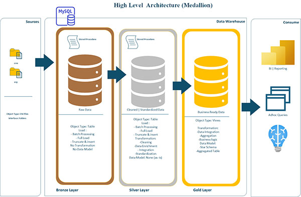
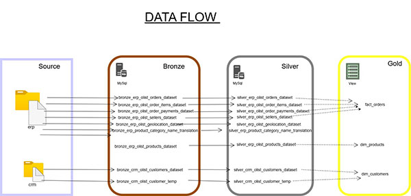
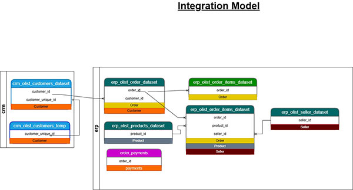

## Medallion  Data Warehouse Project 
---

>### Project Overview:
"A data warehouse is a subject-oriented, integrated, time-variant and non-volatile collection of data in support of management decision
making process".


- 🎯 Objective:
This is a portfolio data warehousing project with the under listed developmental goals:
    - **Data Architecture**: Design and implementation of data warehouse using the medellion architecture: **Bronze, Silver, Gold layers**.

    

    - **ETL** : This process involves Extracting , Transforming and Loading data from the source system to the data warehouse ensuring data cleaniness ,consistency,and completeness.

    

    - **Data Modelling** :
    This involves the identification of relatiionship in tables and the development of fact and dimension tables/views basicaly in the gold the  layer according to design specification.

    

    - **Reports & Analytics** : Using sql to analize the data for insights and decision making and also making visualization with tools like Power Bi.

- ### 🛠️ Skills: 
    - SQL
    - MySql
    - VS Code
    - Jupyter Notebook
    - Python
    - Power Bi
    - Git/Github

<!-- - ### 🛠️ Tools: #### M -->


>### 📂 Repository Structure:
```
Medallion Data Warehouse Project: 
|
|____ DataSource/
|         |__ erp & crm raw dataset used for the project                 
|
|____Docs/
|       |__data_architechture.vsdx # this is a visio file for data achitecture
|       |__ data_flow.drawio
|       |__integration_model.drawio
|       |__ data cataloq
|       |__populate_customers_name.ipnb  # this a jupyter notebook file that was use to populate the customers with FAKE names
|____Quality_Test/
|       |_quality_checks_silver.sql # this script is for silver quality checks
|       |_
|       |_ 
|
|____Scripts/
|       |_Bronze/ # this folder bronze scripts
|       |_Silver/ # this folder silver scripts
|       |_Gold/   # this folder gold scripts
|____Reports & Analytics/
|       |_ Sql EDA
|____ReadMe.md

```

>### License:
You are free to use share and modify this project, only don't fail to make an attribution; the project is license under the MIT licence.

>### About Me:
 I am Obulor Nkweke a Data Analyst with passion to make data speak and with an exceptional interest in eCommerce data analytics.
 You can connect with me:
 
   

>Connect:

 [](https://www.linkedin.com/in/obulornkweke/) 

