## Medallion  Data Warehouse Project 
---

>### Project Overview:
This is an end-to-end data analytic project consisting of three parts. 
- The first part  involves the design and implementation of data warehouse using the medallion architecture.
- While in the second part we  get our hands dirty using sql to do an eda, using dataset from the warehouse.
- And finally we shall visualize the dataset using Power Bi where we shall do some further analysis.

## Project Github: 
The entire project can be found here:  [github]("https://github.com/ObulorN/medallion_data_warehouse")

## 🧱 Part 1: Medallion Data Warehouse.
"A data warehouse is a subject-oriented, integrated, time-variant and non-volatile collection of data in support of management decision
making process". 
In this section will be building a data warehouse using MySql dialect.

**Project Dataset:** 

    [Data source](https://www.kaggle.com/datasets/olistbr/brazilian-ecommerce)

The data source is a collection of nine csv files, which i classified into erp and crm files, below is the project data source repository structure:

>### 🗂️ Repository Structure:
```
Medallion Data Warehouse Project: 
|
|____ DataSource/
|         |__ erp & crm raw dataset used for the project                 
|
|____Docs/
|       |__data_architechture.vsdx # this is a visio file for data achitecture
|       |__ data_flow.drawio
|       |__integration_model.drawio
|       |__ data cataloq
|       |__populate_customers_name.ipnb  # this a jupyter notebook file that was use to populate the customers with FAKE names
|
|____EDA/
|      |__images
|      |__scripts  # this folder contain eda scripts.
|____Quality_Test/
|       |_quality_checks_gold.sql # this script is for gold quality test
|       |_quality_checks_silver.sql # this script is for silver quality test
|
|____Scripts/
|       |_Bronze/ # this folder contain bronze scripts
|       |_Silver/ # this folder contain silver scripts
|       |_Gold/   # this folder contain gold scripts
|____Visualisation/
|       |_ olist_data_analysis.pbix
|____ReadMe.md

```

- 🎯Part 1 Objectives:

    - **Data Architecture**: Design and implementation of data warehouse using the medellion architecture: **Bronze, Silver, Gold layers**.

    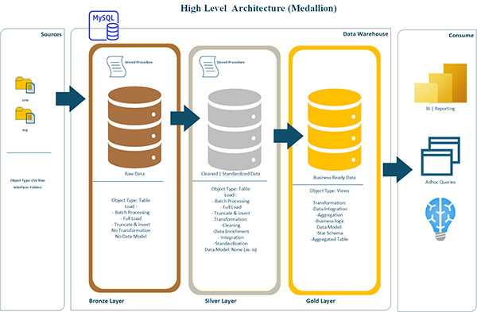

    - **ETL** : This process involves Extracting , Transforming and Loading data from the source system to the data warehouse ensuring data cleaniness ,consistency,and completeness.

    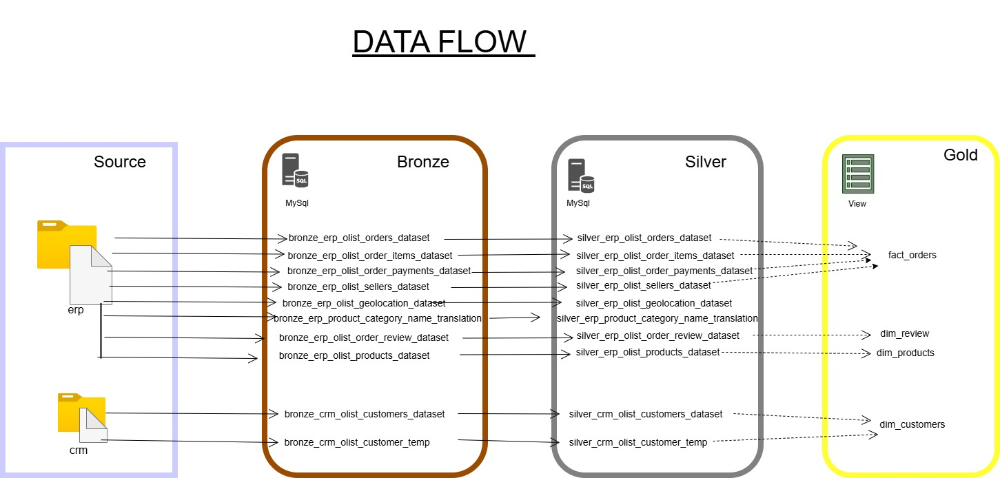

    - **Data Modelling** :
    This involves the identification of relatiionship in tables and the development of fact and dimension tables/views basicaly in the gold the  layer according to design specification.

    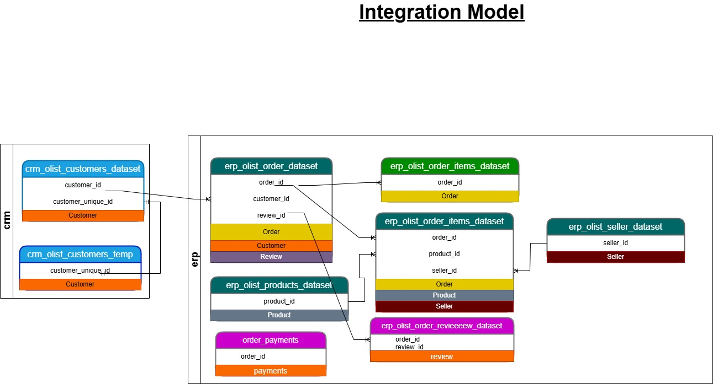

    - **Reports & Analytics** : Using sql  to analize the data for insights and decision making and also making visualization with tools using Power Bi.

  
- ### 🛠️ Skills: 
    - SQL
    - MySql
    - VS Code
    - Jupyter Notebook
    - Python
    - Power Bi
    - Git/Github

<!-- - ### 🛠️ Tools: #### M -->


## ⛓️ Part 2: EDA with SQL
- EDA with SQL: SQL stands for structural query languge which is the language used in communicating with most relational database system.
We shall be using sql to analize the dataset under the following subgroups:
- Dimension Analysis:
- Measures Analysis:
- Part To Whole Analysis
- Cumulative Analysis:
- Magnitude Analysis:
- Time Intelligence Analysis:
- Geo Location Analysis:

Some of the **Insights** from the sql eda is highlighted below:
- Profit measures: 
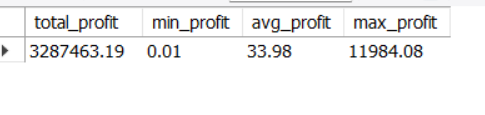

- Part to Whole: 
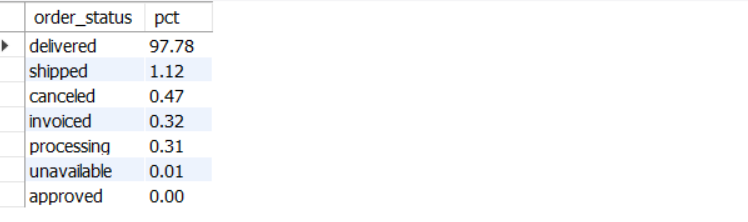


- Total Customer Count: 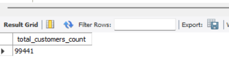

- Most Recent Customers : 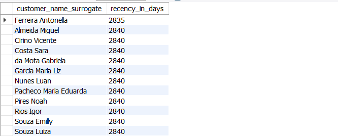

- Total catalog value: 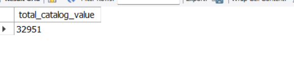


- Most Profitable Category: 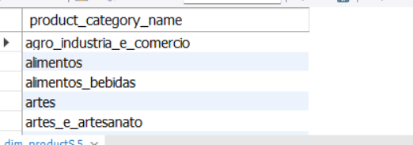


- Top Rank Cities: 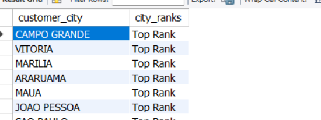
- Order Delivery Measures: 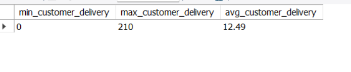

- MoM Profit: 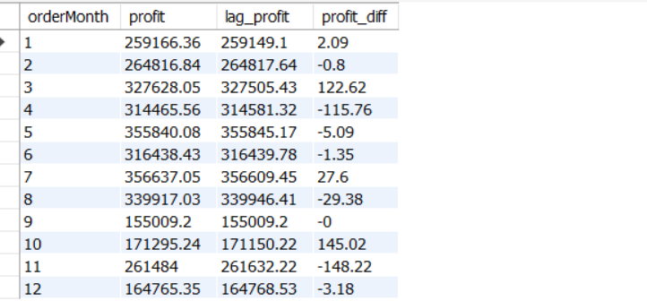

- YoY Profit: 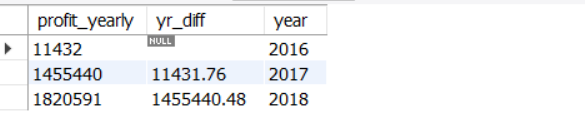

Meanwhile the full eda analysis script can be found in the eda_projet sql file [here](./EDA/Scripts/eda_project.sql)


## 📶 Part 3: Visualization with Power Bi
Below are some visuals from the Power Bi projects and some insights there in:

- Time Intelligence Analysis:

  - **Insights:**
     - Profit have continious upward trend over the years.
     - Monday got the most profit while Saturday had the least.
     - Total orders also had continious upward trend over the years.
     - July got the most profit while Sept had the least.


-  Profit Part to Whole Analysis:

   - **Insights:**
      - Cama mesa bhanho category had the most profit percentage of 10%.
      - Sugaros-e-servicos had the least percent profit.

- Magnitude Analysis:

 - **Insights:**
      - SP state had both the most profit and number of orders .
      - Sao Paolo city got us the highest number of customers while Colorado, Itaqui etc got least of the customers .
      - SC state had about 1K orders greater than that of BA state, but BA made more profit compared to SC.


- Cumulative Analysis:

  - **Insights:**
      - Most customers paid with Credit card amounting to a total value of R12.54M.
      - Belato came second with R2.87M .

- Measures Analysis:


- GeoLocation Analysis:


- Dashboard


## 📝 Recommedantion:
   - Weekend (saturday/sunday) and month of september had the least profit therefor running campaigns and promo in these days and month will be recommended.

   - Cities of Colorado, Itaqui etc, got us the least customers, so investigating product category prefered by customers of these cities and also restock along such product line will be recomended.

   -To attract new customers and also extend reach;  advertising through  multiple channels will be recommended.

   ## 📝 Conclusion:
   Many thanks for spending your time on my projects; i hope you find this useful, feel free to reach me through the channels below.

>### License:
You are free to use share and modify this project, only don't fail to make an attribution; the project is license under the MIT licence.

>### About Me:
My name is Obulor Nkweke a Data Analyst with passion to make data speak. I also have  an exceptional interest in eCommerce data analytics.
 You can connect with me:
 
   

>Connect:

 [](https://www.linkedin.com/in/obulornkweke/) 
 

 ##### Resources:
 [**Data With Baraa:**]( https://www.youtube.com/watch?v=9GVqKuTVANE&list=PLNcg_FV9n7qaUWeyUkPfiVtMbKlrfMqA8)


[**Luck Barousse:**](
 https://www.youtube.com/watch?v=FwjaHCVNBWA&t=60s)
